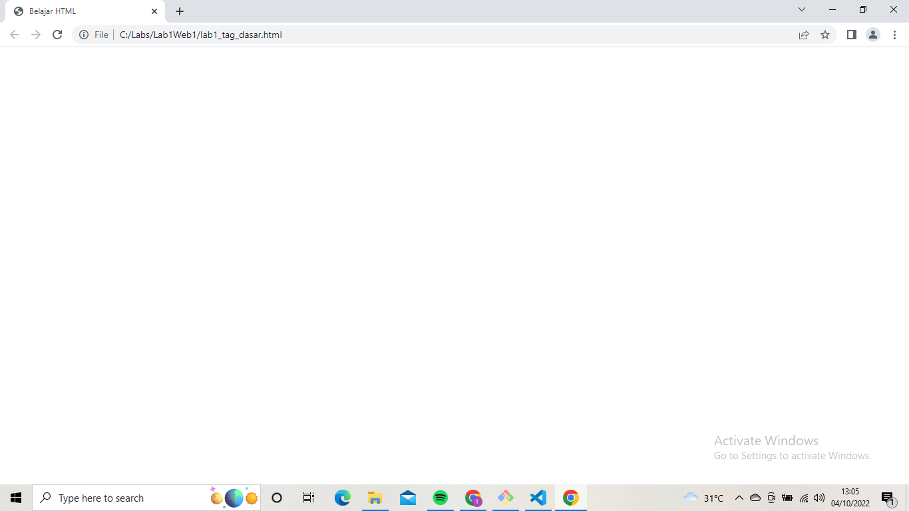
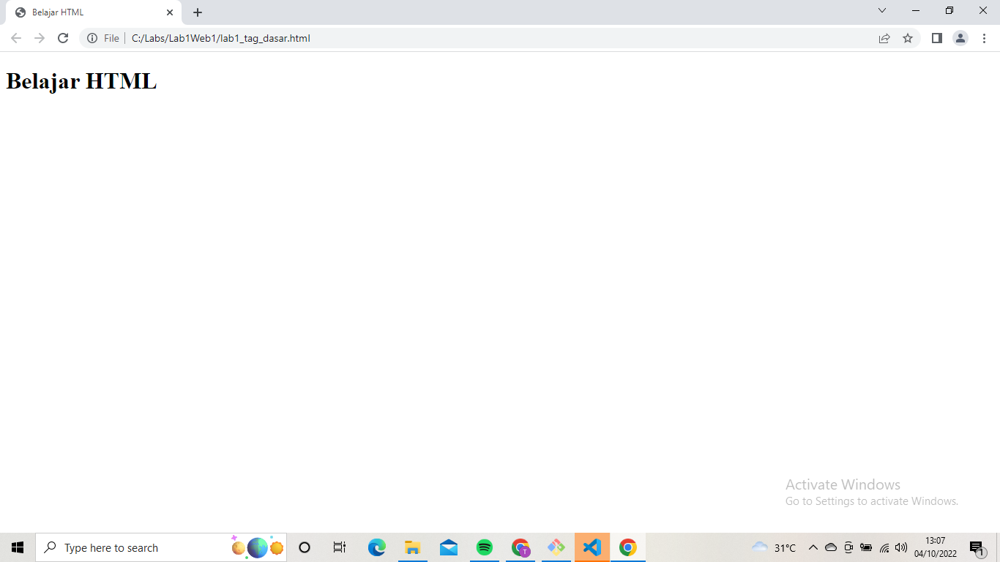
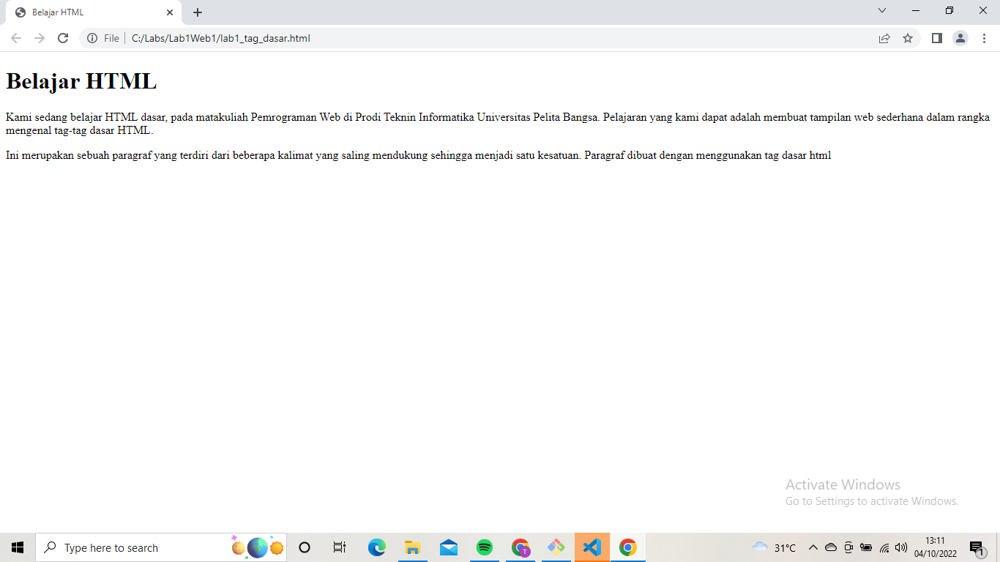
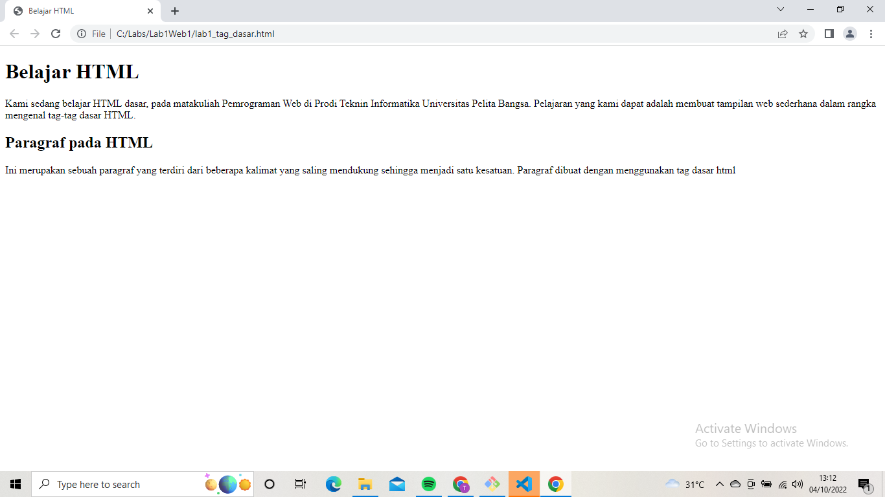
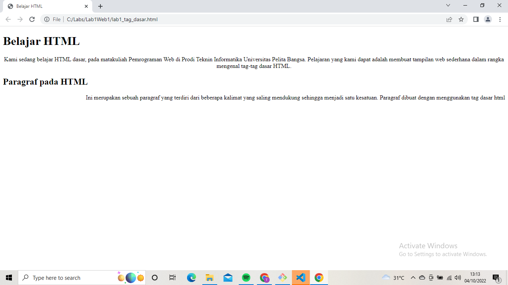
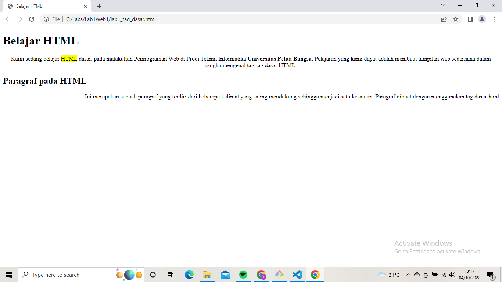
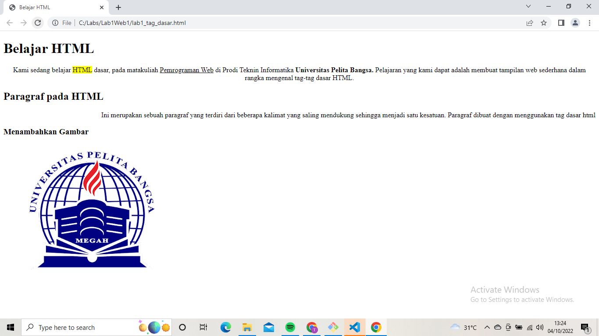
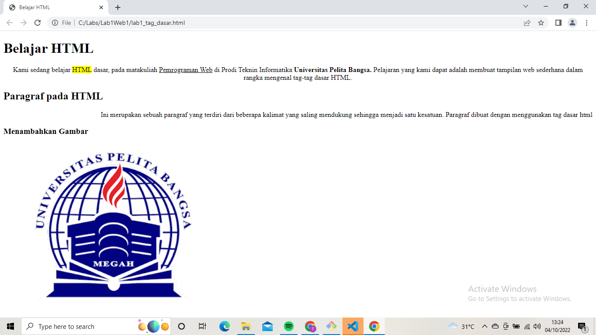
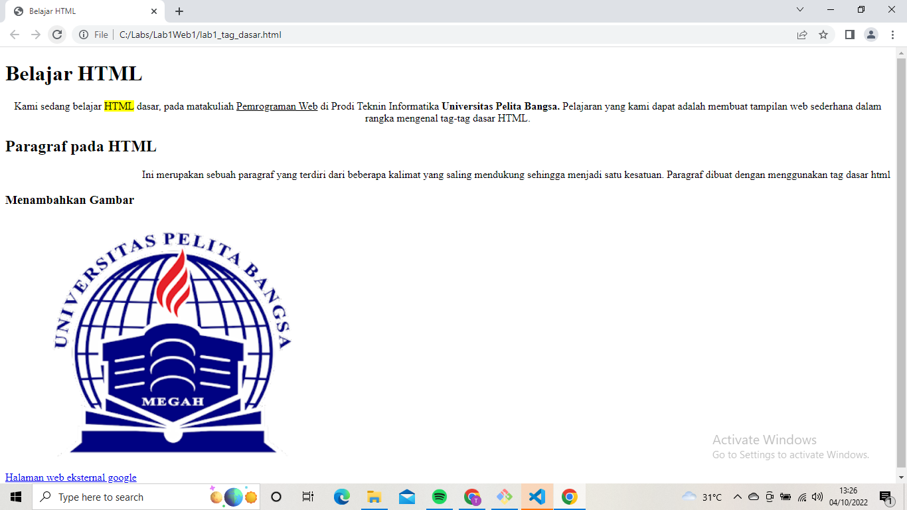

# Lab1Web1
## Belajar tag dasar HTML

### Menamai judul Halaman
kode tag untuk menambahkan judul halaman <title>
ini adalah tampilannya

### Menambahkan Judul
kode tag untuk menambahkan judul pertama <h1>
ini adalah tampilannya

### Menambahkan Paragraf
kode tag untuk menambahkan pragraf 

ini adalah tampilannya

### Menambahkan Judul Paragraf
kode tag untuk menambahkan judul paragraf <h2>
ini adalah tampilannya

### Mengatur teks paragraf
kode tag untuk mengatur teks paragraf align="center" align="center"
ini adalah tampilannya

### Memformat Teks
kode tag untuk menebalkan teks <b> mewarnai teks <mark> underline teks <i>
ini adalah tampilannya

### Menambahkan Gambar
kode tag untuk menambahkan gambar 
ini adalah tampilannya

### Mengatur ukuran Gambar
kode tag untuk mengatur ukuran gambar 
ini adalah tampilannya

### Menambahkan Link
kode tag untuk menambahkan link <a href="link">
ini adalah tampilannya

Jawaban :
1. Iya ada error ketika salah penulisan tag
2. tag 
 untuk membuat paragraf, tag   untuk membuat garis baru
3. tag title untuk membuat judul halama
4. sebaiknya diisi keduanya agar gambar terlihat proposional karena width untuk mengatur lebar dan heigt untuk mengatur tinggi
5. _blank untuk membuka link dihalaman tab baru
_self untuk membuka link dihalaman sendiri
_parent untuk membuka link diframe yang satu tingkat diatas
_top untuk membuka link diframe paling atas
